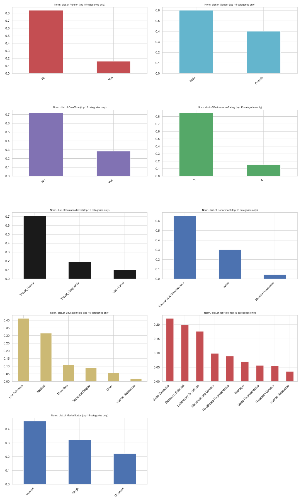
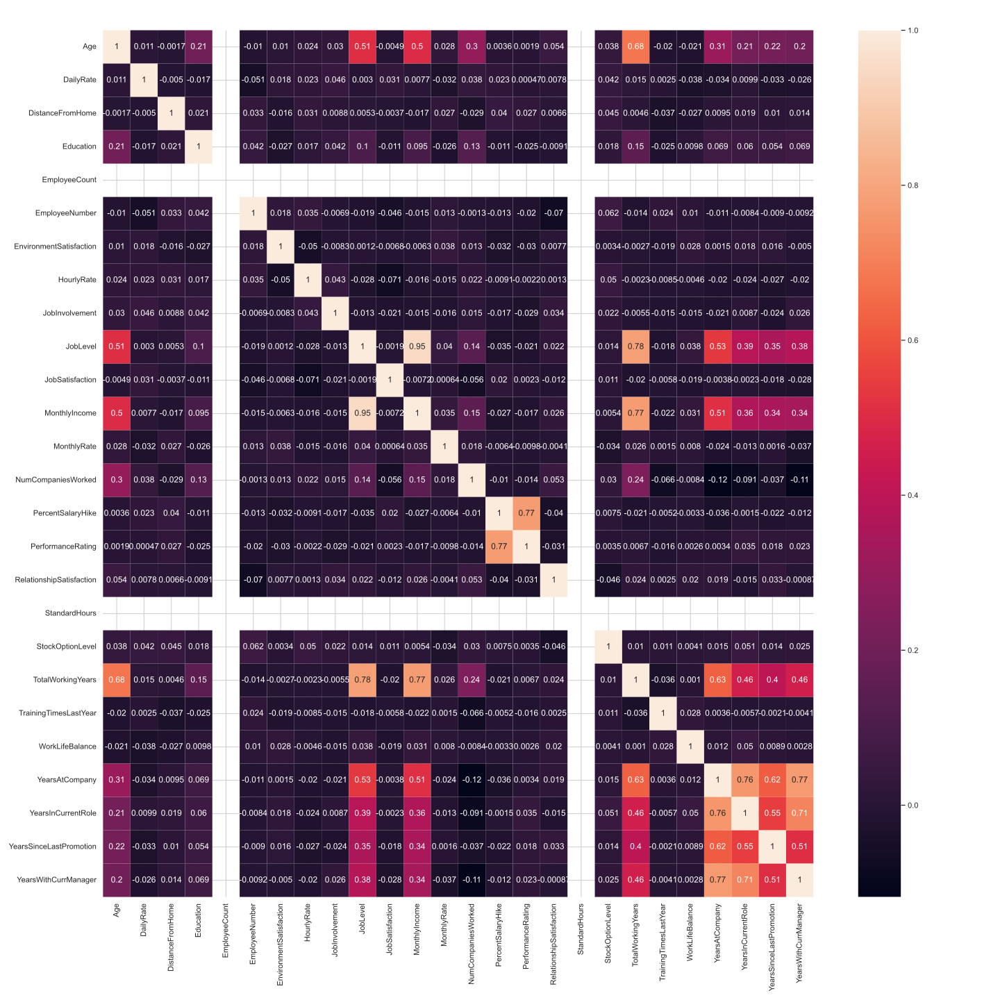
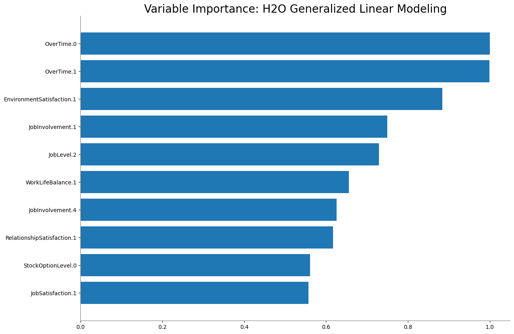
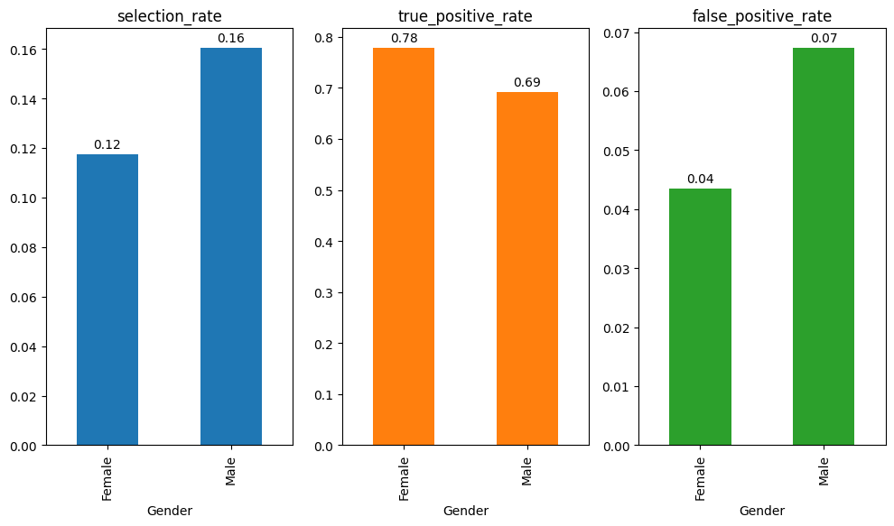

# Employee Attrition Predictor: Project Overview 
* Created a tool that predicts whether IBM employees will leave the employee to help the HR department optimize their resources for retention efforts
* Engineered features from different employee attributes to quantify the career stability, development, and incentives of employees
* Automated machine learning processes (AutoML) using H2O package on Python to reach the best model. 
* Evaluated the model's interpretability and fairness using H2O and Fairlearn respectively

## Code and Resources Used 
**Python Version:** 3.11.9  
**Packages:** pandas, numpy, sklearn, matplotlib, seaborn, h2o  
**For Package Requirements:**  ```%pip install -r requirements.txt```  
**Data Set Source:** https://www.kaggle.com/datasets/pavansubhasht/ibm-hr-analytics-attrition-dataset

## Data Cleaning
After loading the data, the data was cleaned to ensure its veracity and its compatibility with the model process. The following changes were made:

*	Imputed value of 1 where `NumCompaniesWorked` = 0
*   Added new columns for Position Stagnation Ratio, Management Stability Ratio, Job Level Salary Ratio, Department Salary Ratio, Education Return Ratio, and Company Loyalty Ratio


## EDA
The distributions of the data and correlations for various variables were plotted [here](reports/sweetviz_eda_report.html). Some of the key highlights are shown below:




An overview dashboard was also published on [Tableau](https://public.tableau.com/views/IBM_Employee_Attrition_17406306113120/Overview?:language=en-GB&:sid=&:redirect=auth&:display_count=n&:origin=viz_share_link) to enable a high level exploration of the employee data.

## Model Building 

First,  categorical variables were transformed into dummy variables using one-hot encoding. The data was split into train and tests sets with a test size of 30%.   

H2O's AutoML function automated the building of different models and evaluated them using logloss. Logloss was chosen as the sorting metric to penalize incorrect high-confidence predictions.   

To address data imbalance, balanching techniques were considered and employed on the dataset to improve the performance. Thus, two separate AutoML runs were conducted, which are listed below:
1. Imbalanced dataset
2. Balanced dataset, using ```balance_classes = True``` in H2OAutoML

## Model performance

### Test Performance using CV-selected Threshold based on Max-F1

The test performances from the leader models are relatively similar(?)

Model 1: Trained on Imbalanced Dataset

| Actual/Prediction | 0    | 1    | Error    | Rate    |
| :---:   | :---: | :---: | :---: | :---: |
| 0     | 370   | 14    | 0.0365    | 14/384    |
| 1     | 25    | 32    | 0.4386       | 25/57     |
| Total | 395   | 46   | 0.0884 | 39/441  |

Model 2: Trained with Balanced Classes

| Actual/Prediction | 0    | 1    | Error    | Rate    |
| :---:   | :---: | :---: | :---: | :---: |
| 0     | 344   | 40    | 0.1042    | 40/384    |
| 1     | 14    | 43    | 0.2456       | 14/57     |
| Total | 358   | 83   | 0.1224 | 54/441  |

Comparison: 

|Metric     |Model 1    |Model 2    |
| :---:     | :---:     | :---: | 
|F1 Score   |0.621359   |0.614286|
|MCC        |0.576155   |0.558062|
|TPR (Recall)|0.561404  |0.754386|
|FPR        |0.036458   |0.104167|
|Precision  |0.695652   |0.518072|
|Accuracy   |0.911565   |0.877551|

While both models achieved similar F1 scores, there was a trade off between recall and precision values. Hence, it is difficult to choose a model as it would compromise the detection of employee attrition/retention.

### Test Performance using CV-selected Threshold based on Max-Absolute MCC

The models' thresholds were tuned using the CV-selected Thresholds based on Max-Absolute MCC. The Absolute MCC considers all four confusion matrix values (TP, TN, FP, FN), making it a more balanced metric than F1 when dealing with class imbalances.

Model 1: Trained on Imbalanced Dataset

| Actual/Prediction | 0    | 1    | Error    | Rate    |
| :---:   | :---: | :---: | :---: | :---: |
|0      |370    |14 |0.0365 |14/384 |
|1      |25	    |32 |0.4386 |25/57  |
|Total  |395    |46 |0.0884 |39/441 |

Model 2: Trained with Balanced Classes

| Actual/Prediction | 0    | 1    | Error    | Rate    |
| :---:   | :---: | :---: | :---: | :---: |
|0      |361    |	23|	0.0599|	23/384|
|1      |16     |	41|	0.2807|	16/57|
|Total  |377    |	64|	0.0884|39/441|

Comparison: 

|Metric     |Model 1    |Model 2    |
| :---:     | :---:     | :---: | 
|F1 Score   |0.621359   |0.677686|
|MCC        |0.576155   |0.628048|
|TPR (Recall)|0.561404  |0.719298|
|FPR        |0.036458   |0.059896|
|Precision  |0.695652  |0.640625|
|Accuracy   |0.911565  |0.911565|

### Model Selection

Model 2 was selected due to its higher F1 score (0.677) and MCC (0.709), indicating better overall performance in handling class imbalance and capturing the correlation between predictions and actual values.

While Model 2 has a slightly higher false positive rate (FPR) (0.06 vs. 0.04), it compensates with a significantly higher recall (0.719 vs. 0.561), meaning it correctly identifies more actual positives and reduces false negatives. This is particularly important in employee attrition detection, where missing at-risk employees (false negatives) can be more costly than investing in retention efforts.

## Model Interpretation
The selected model (Model) is a GLM model. The variable importances of this model are illustrated below.



## Model Fairness
The selected model was evaluated for fairness using the Fairlearn package. A key highlight is shown below:


The fairness metrics for Gender are as follows: 

|Fairness Metric|Observation|Implication|
|:---:|:---:|:---:|
|Selection Rate Parity|Slightly higher for males (16% vs 12%)|This difference may stem from the dataset composition.|
|TPR Parity|Lower for males (69% vs 78%)|Risk of male employee attrition is underpredicted. Their needs could be neglected during retention efforts.|
|FPR Parity|Slightly higher for males (7% vs 4%)| Male employees may face unjustified interventions and scrutiny, limiting their growth in the company.|

## Conclusion

This project aimed to predict employee attrition at IBM using automated machine learning. After evaluating different approaches, Model 2 was selected for its balance of precision and recall, ensuring both accuracy and reliability.

Key takeaways:
- Feature Importance: Overtime, environment  satisfaction, and job involvement emerged as strong predictors of attrition.
- Fairness Analysis: The fairness assessment revealed a slight disparity in model predictions across gender, highlighting areas for potential bias mitigation.
- Future Improvements: Incorporating additional features (e.g., performance review data) and experimenting with more advanced resampling techniques could enhance predictive performance.

## Project Organization

```
├── README.md          <- Project Overview
├── data
│   ├── interim        <- Intermediate data that has been transformed
│   ├── processed      <- The final, canonical data sets for modeling
│   └── raw            <- The original, immutable data dump
│
├── models             <- Trained and serialized models, model predictions, or model summaries
│   ├── allfeatures    <- Models trained using imbalanced data
│   └── balanceclasses <- Models trained using balanced data
│
├── notebooks          <- Jupyter notebooks. Naming convention is a number (for ordering),
│                          and a short `-` delimited description, e.g.
│                         `1.0-jqp-initial-data-exploration`
│
├── references         <- Data dictionaries, manuals, and all other explanatory materials
│
├── reports            <- Generated analysis as HTML, PDF, LaTeX, etc.
│   ├── AutoViz        <- Generated AutoViz graphics and figures to be used in reporting
│   └── best-model     <- Generated model interpretation and fairness evaluation for the selected model
│
└──  requirements.txt   <- The requirements file for reproducing the analysis environment, e.g. generated with `pip freeze > requirements.txt`

```

--------