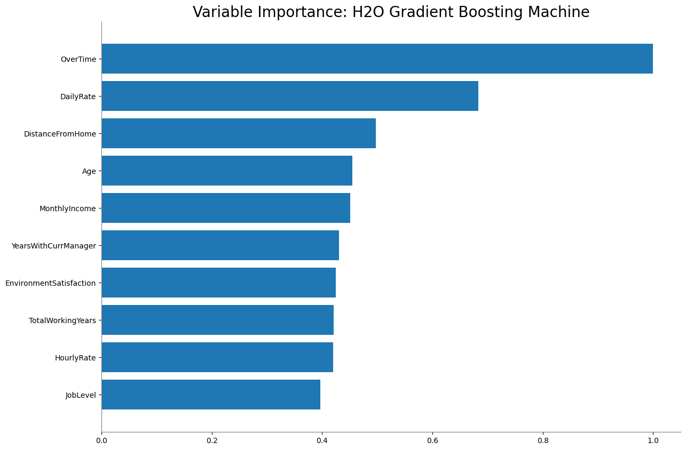
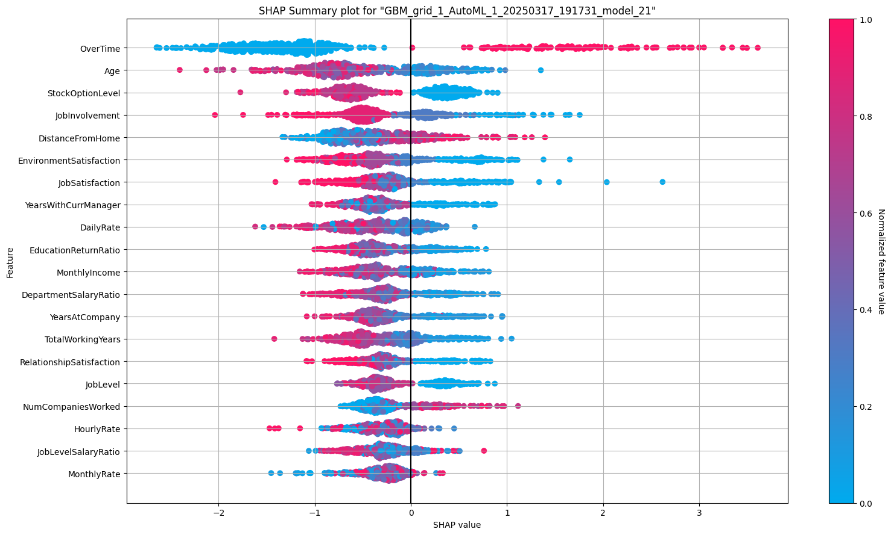

# Employee Attrition Predictor: Project Overview 
* Created a tool that predicts if employees at IBM will leave the employee to help the HR department optimize their resources for retention efforts
* Engineered features from different employee attributes to quantify the career stability, development, and incentives of employees
* Automated machine learning processes (AutoML) using H2O package on Python to reach the best model. 
* Evaluated the model's interpretability and fairness using H2O and Fairlearn respectively

## Code and Resources Used 
**Python Version:** 3.11.9  
**Packages:** pandas, numpy, sklearn, matplotlib, seaborn, selenium, flask, json, pickle  
**For Package Requirements:**  ```%pip install -r requirements.txt```  
**Data Set Source:** https://www.kaggle.com/datasets/pavansubhasht/ibm-hr-analytics-attrition-dataset

## Data Cleaning
After loading the data, the data was cleaned to ensure its veracity and its compatibility with the model process. The following changes were made:

*	Imputed value of 1 where `NumCompaniesWorked` = 0
*   Added new columns for Position Stagnation Ratio, Management Stability Ratio, Job Level Salary Ratio, Department Salary Ratio, Education Return Ratio, and Company Loyalty Ratio


## EDA
I looked at the distributions of the data and the value counts for the various categorical variables. Below are a few highlights from the pivot tables. 


## Model Building 

First, the categorical variables were transformed into dummy variables using one-hot encoding. The data was split into train and tests sets with a test size of 30%.   

H2O's AutoML function automated the building of different models and evaluated them using logloss. Logloss was chosen as the evaluation metric to penalize incorrect high-confidence predictions.   

To address data imbalance, oversampling and undersampling techniques were employed on the training dataset. Thus, three AutoML runs were conducted for the thress training datasets, which are obtained via oversampling, undersampling, and without sampling respectively.

## Model performance
The training dataset created from oversampling build a model that outperformed the other datasets.
*	**Oversampling Dataset** : logloss = 0.0265844
*	**Undersampling Dataset**: logloss = 0.539914
*	**Dataset Without Sampling**: logloss = 0.352263

## Model Evaluation
The cross validation performance of the leader model shows promising results at a threshold of 0.805.

| Actual/Prediction | 0    | 1    | Error    | Rate    |
| :---:   | :---: | :---: | :---: | :---: |
| 0 | 849   | 0   | 0   | 0/849   |
| 1 | 9   | 840   | 0.01   | 9/849   |
| Total | 858   | 840   | 0.005   | 9/1698   |

However, the test performance showed highly imbalanced results, suggesting potential overfitting during the training and cross-validation stage. The model recorded high precision (100%) but low recall (12.3%). This means it only predicts that an employee will leave when the model is very confident but misses 87.7% of actual positives.

| Actual/Prediction | 0    | 1    | Error    | Rate    |
| :---:   | :---: | :---: | :---: | :---: |
| 0 | 384   | 0   | 0   | 0/384   |
| 1 | 50   | 7   | 0.88   | 50/57   |
| Total | 434   | 7   | 0.113   | 50/441   |

## Model Interpretation
The leader model selected was a Stacked Ensemble Model with a GBM model being its dominant model. The variable importances of the said dominant model are illustrated below. The SHAP summary plot below shows the contribution of the features for each row of data in the test set.





## Model Fairness

## Project Organization

```
├── LICENSE            <- Open-source license if one is chosen
├── README.md          <- Project Overview
├── data
│   ├── external       <- Data from third party sources
│   ├── interim        <- Intermediate data that has been transformed
│   ├── processed      <- The final, canonical data sets for modeling
│   └── raw            <- The original, immutable data dump
│
├── models             <- Trained and serialized models, model predictions, or model summaries
│
├── notebooks          <- Jupyter notebooks. Naming convention is a number (for ordering),
│                         the creator's initials, and a short `-` delimited description, e.g.
│                         `1.0-jqp-initial-data-exploration`
│
├── references         <- Data dictionaries, manuals, and all other explanatory materials
│
├── reports            <- Generated analysis as HTML, PDF, LaTeX, etc.
│   └── figures        <- Generated graphics and figures to be used in reporting
│
├── requirements.txt   <- The requirements file for reproducing the analysis environment, e.g.
│                         generated with `pip freeze > requirements.txt`
│
└── src                         <- Source code for this project
    │
    ├── __init__.py             <- Makes src a Python module
    │
    ├── config.py               <- Store useful variables and configuration
    │
    ├── dataset.py              <- Scripts to download or generate data
    │
    ├── features.py             <- Code to create features for modeling
    │
    │    
    ├── modeling                
    │   ├── __init__.py 
    │   ├── predict.py          <- Code to run model inference with trained models          
    │   └── train.py            <- Code to train models
    │
    ├── plots.py                <- Code to create visualizations 
    │
    └── services                <- Service classes to connect with external platforms, tools, or APIs
        └── __init__.py 
```

--------